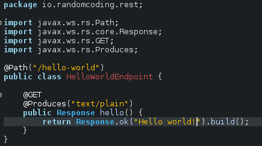

# demo-rest
This is a REST Hello World example using JBoss Forge.

## Prerequisites
- JBoss Forge
- Java JDK 1.8
- Maven
- Java Web Application server (Wildfly)

## Getting started

- Start Jboss forge cli.
- Create a new project:
```bash
project-new --named demo-rest --type war --stack JAVA_EE_7
```
With this command you are creating a new project named "demo-rest" with war packaging and using JavaEE 7.
- Add new endpoint:
```bash
rest-new-endpoint --named HelloWorldEndpoint --application-path /api --path hello-world --target-package io.randomcoding.rest
```
In this command you are creating a new JAX-RS Activator named RestApplication with application path as "/api", a new REST endpoint with path "/hello-world" and described in HelloWorldEndpoint.java class.

## Edit the project

- Open the generated project in your favorite Java code editor.
- Open HelloWorldEndpoint class and edit it as follows:



- Add Web Descriptor (web.xml).

## Build
```bash
mvn clean install
```

## Deploy
- Deploy the generated WAR package. This file should be found in target/demo-rest.war.

## Test

Test the service open this URL: http://127.0.0.1:8080/demo-rest/api/hello-world

